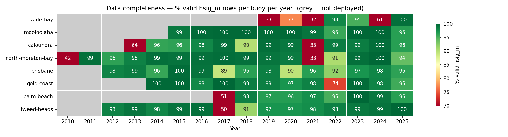
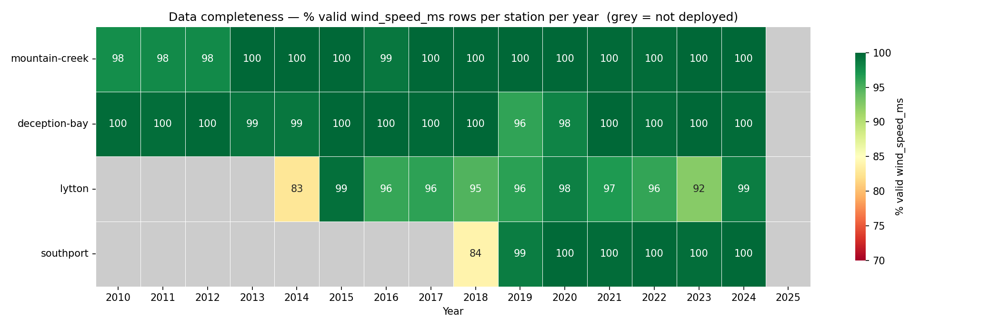
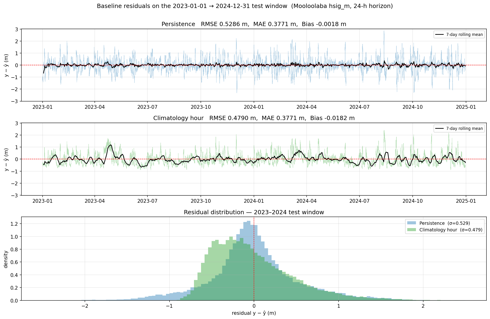
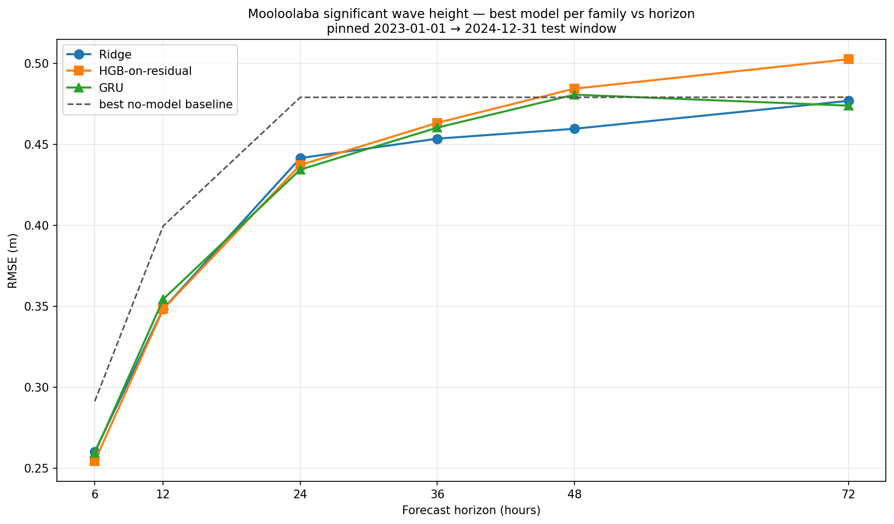

# Surf Height Prediction 2

An exercise in predictive modeling, this project is all about forecasting wave height off the sunny coast in Queensland, Australia. I chose to revisit this subject to see if I could beat [my previous model](https://github.com/AnthonyBurre/Surf-Height-Prediction) performance, but found that the data source had revised some of its measurements, yeilding a much rougher dataset and making direct model performance comparison unhelpful. Even so, this expansion was an enjoyable learning experience.

## Data source

All data in this project comes from the [Queensland Government open data portal](https://www.data.qld.gov.au/organization/environment-tourism-science-and-innovation), which provides us with several wind and wave monitoring stations in the region. Since all raw records are AEST we don't have to worry about time changes, and every output unified CSV carries a gap-free Brisbane `datetime` index.

### Upstream revisions note

The QLD portal publishes these as derived, delayed-mode wave parameters, and it periodically re-derives and republishes whole yearly resource files. Comparing an October 2025 snapshot against a re-download confirmed this: of ~178k shared timestamps, **26.9% changed**, with a clear signature rather than random drift, but no revision notice published.

- `hmax_m`, `tz_s`, `tp_s`, and `peak_dir_deg` *all* change on the same ~27% of rows (`sst_c` on ~26%).
- New values are higher 50.3% / lower 49.7% of the time (mean Δ ≈ 0, -0.011 m) and the maximum is unchanged (5.204 m), so it is not a clipping, units, or one-sided shift.
- Magnitudes are large (median |Δ| = 0.42 m).
- They form 195 contiguous blocks (median ~5 days, max 18), never scattered single points, with no time-of-day pattern.
- The largest blocks all fall in the Dec–Mar storm/cyclone season (e.g. 2025-01-27→02-15, 2023-12-01→12-11).
- Waves >3 m were revised 40% of the time (mean |Δ| 0.63 m) vs ~25% / 0.11 m for 0.5-1.5 m waves.
- 2017, 2018, and 2021 are untouched; 2015/16/19/20/22/23/24/25 were republished.

The net effect is that the revised data is rougher:
- 12h autocorrelation dropped 0.85 → 0.74
- persistence RMSE rose from 26.5 cm on the old snapshot to ~40 cm now.

I assume the revision is a data-quality improvement (more accurate storm-period measurements), but it means absolute RMSE is not comparable across snapshots or against my old project on a smaller and older subset of this data.


### Wave buoy network

30-minute cadence. Mooloolaba is the prediction target; Brisbane, Caloundra, Gold Coast, North Moreton Bay, Palm Beach, Tweed Heads, and Wide Bay feed in as neighbour-buoy features where their histories overlap.

| Column | Description |
|--------|-------------|
| `hsig_m` | Significant wave height (meters) |
| `hmax_m` | Maximum wave height (meters) |
| `tz_s` | Zero-crossing period (seconds) |
| `tp_s` | Peak period (seconds) |
| `peak_dir_deg` | Peak wave direction (degrees) |
| `sst_c` | Sea surface temperature (°C) |



### Wind (air-quality monitoring network)

Hourly cadence (reindexed onto the 30-minute wave grid by forward-fill), 10 m ultrasonic wind sensors on the QLD air-quality monitoring stations. Mountain Creek pairs with the Mooloolaba buoy, Deception Bay sits ~50 km south on Moreton Bay, Lytton is at the mouth of the Brisbane River, and Southport sits on the Gold Coast.

| Column | Description |
|--------|-------------|
| `wind_dir_deg` | Wind direction (degrees true north) |
| `wind_speed_ms` | Wind speed (meters/second) |
| `wind_sigma_theta_deg` | Wind direction standard deviation (degrees) |
| `wind_speed_std_ms` | Wind speed standard deviation (meters/second) |



> The coverage grids define the breadth-vs-depth trade for any experiment: how far back to train, and how many neighbour sources to include. Palm Beach (deployed 2017), Southport wind (mid-2018), and Wide Bay (2019, the only buoy upstream of northerly swells) only appear later.


## Data preparation

### Feature engineering

The feature matrix is assembled in three layers, each a single call:

1. **Base primary-buoy matrix** (`fc.build_buoy_features`) — circular encoding, hour/doy time features, lags, rolling stats, momentum. Lag/rolling/delta grids are tunable via `FeatureConfig`. For sequence models, `fc.build_seq_features` swaps in raw channels with no pre-built lags (the model windows its own input).
2. **Neighbour buoys** (`fc.add_neighbour_features`) — raw value, lag copies, and rolling mean/std per neighbour column, reusing the same `FeatureConfig`.
3. **Wind stations** — same `add_neighbour_features` call on each wind station's columns. `fc.load_wind` sin/cos-encodes `wind_dir_deg` and station-prefixes every column so cross-station features stay distinguishable.

### Preprocessing pipeline

`forecast.preprocess.Preprocessor` bundles the three steps the playgrounds run between `chronological_split` and `model.fit`:

1. **Drop sparse columns** — any column whose **train-set** NaN fraction exceeds `max_nan_frac` (default 0.5) is removed. Mean-imputing a near-empty column gives a near-constant feature that silently corrodes gradient-based sequence models. The `wave_column_coverage.png` and `wind_column_coverage.png` EDA figures surface candidates ahead of time.
2. **Mean impute** — column-wise mean from training data fills remaining NaNs.
3. **Scale** (optional) — `"robust"` (median/IQR) or `"standard"`. Linear models default to robust because wave data is heavy-tailed and storm spikes would inflate a standard-deviation scale. Trees (HGB) take the raw matrix. Sequence models scale internally (`scaler="robust"` or `"standard"`, fit on train) and consume the unscaled `build_seq_features` frame. `*_sin`/`*_cos` columns pass through untouched in all cases.


## Non-model baselines

Two no-model references frame every result in this project:

- **Persistence** — predict ŷ(t+h) = y(t). Strong at short horizons because Mooloolaba's `hsig_m` is highly autocorrelated on the order of hours, so "looks like now" is hard to beat in the first half-day.
- **Climatology hour** — predict the train-set mean of `hsig_m` conditioned on hour-of-day(t+h). Horizon-independent: it ignores `t` entirely, so its RMSE is flat at ~0.48 m across every horizon.

The two crossover between **h=12 and h=24** on the pinned 2023-01-01 → 2024-12-31 test window, so persistence wins for h≤12, climatology from h≥24 onward:



## Model selection and tuning

Three model families are compared head-to-head: **Ridge** (linear, robust-scaled), **HGB-on-persistence-residual** (gradient-boosted trees fit to the persistence error), and a regularised **GRU** (sequence model over the raw circular-encoded channels). Each is tuned on the pinned 2023-01-01 → 2024-12-31 test window — Ridge at α=1, HGB at `max_iter=800` / `lr=0.03` / `depth=6`, the GRU from a small hyperparameter sweep (`seq_len=48`, hidden 64, 1 layer) — and scored across six forecast horizons, each at its best-performing feature combo (combos defined below), against the better of persistence and climatology (the no-model baselines from *Non-model baselines*).



| h | Best baseline RMSE (m) | Ridge (m) | HGB (m) | GRU (m) | Best skill vs baseline |
|---|---|---|---|---|---|
| 6h  | 0.291 (persistence) | 0.260 | **0.254** | 0.259 | +0.127 |
| 12h | 0.400 (persistence) | 0.348 | **0.348** | 0.354 | +0.128 |
| 24h | 0.479 (climatology) | 0.442 | 0.437 | **0.434** | +0.093 |
| 36h | 0.479 (climatology) | **0.453** | 0.463 | 0.460 | +0.053 |
| 48h | 0.479 (climatology) | **0.460** | 0.484 | 0.481 | +0.041 |
| 72h | 0.479 (climatology) | 0.477 | 0.503 | **0.474** | +0.011 |

Bold marks the lowest RMSE at each horizon; the skill column is `1 − RMSE/baseline` for that best model. Combo shorthand: `solo` = primary buoy only; `tweed_mc` = + Tweed Heads + Mountain Creek wind; `5b+3w` = + 5 wave neighbours + 3 wind stations; `wide` = + 7 neighbours + 4 wind, on the shorter 2019–2024 window.

Three conclusions, and they are the whole story:

- **Neighbour and wind stations only earn their keep at short lead.** At h=6 the best models lean on a wider feature set — Ridge's best is the full `wide` build (0.260 vs 0.270 for the primary buoy alone), HGB's is `5b+3w`, the GRU's is `tweed_mc` — but the edge is only ~0.5–1 cm. By h=24 it is gone: the best Ridge and HGB are the primary-buoy-only (`solo`) model (give or take a rounding-level tie), and adding stations from there just hands the model noise to regularise away. The cross-buoy and wind signal is real but shallow — worth something for the first half-day, irrelevant past it.

- **The regularised GRU does not beat the simpler models.** It tracks them closely everywhere and posts two sub-centimetre nominal "wins" (h=24, h=72), but those margins are ≤ 0.3 cm — and the GRU got a hyperparameter sweep that the fixed-config Ridge and HGB did not, which only flatters it. On a single fixed test window, gaps this small sit inside the year-to-year noise (a rolling-origin check on an earlier build put the fold-to-fold spread at ±2–5 cm), so the sequence model's extra weight and training cost buy nothing we can defend.

- **HGB is best at short lead, Ridge is best and steadiest at long lead.** HGB-on-residual wins at h=6/12 but climbs fastest with horizon — by h=36 it is the worst of the three, as its residual target loses the structure that makes it learnable. Ridge sits within a hair of the best at every horizon and is cleanly best from h=36 on; the crossover lands around h=24–36. So for a single model to ship, **plain Ridge on the primary buoy is the pick** — simplest to maintain and never more than noise behind the leader — with the caveat that at very short lead a wider feature set (or HGB) buys a small but genuine gain.

All three clear the no-model baseline comfortably at short range (skill ≈ +0.13 at h=6/12) and then decay toward it: by h=72 even the best model is barely 1% under flat climatology — the point at which observation-only features are exhausted and only a numerical weather/wave model could push further.

## Real world performance

Each new year that passes can be scored as a true blind set against our best models. This way we evaluate them against brand new data that wasn't implicitly leaked through the train/test iterative process. Awaiting the QLD wind 2025 release expected September 2026.

**Pre-committed candidates for 2025**:

- TBD
- TBD
- **TBD Ensemble**

Scoring a new year against these committed candidates is a re-fit of the same recipe on the same training data, not a load of a serialised model. The `Preprocessor` fitted alongside each model captures the drop list, imputer means, and scaler stats, so the held-out year sees the same transformation the model was trained against — including any schema drift (extra columns are dropped, missing required columns raise).

| Year | h | Model | RMSE (cm) | Skill |
|------|---|-------|-----------|-------|
| 2025 | 12h | Ridge | _TBD_ | _TBD_ |
| 2025 | 12h | TCN | _TBD_ | _TBD_ |
| 2025 | 12h | Ensemble | _TBD_ | _TBD_ |
| 2025 | 24h | Ridge | _TBD_ | _TBD_ |
| 2025 | 24h | TCN | _TBD_ | _TBD_ |
| 2025 | 24h | Ensemble | _TBD_ | _TBD_ |
| 2025 | 48h | Ridge | _TBD_ | _TBD_ |
| 2025 | 48h | TCN | _TBD_ | _TBD_ |
| 2025 | 48h | Ensemble | _TBD_ | _TBD_ |


## Reproducibility

### Setup

With [uv](https://docs.astral.sh/uv/) installed:

```bash
uv sync --all-extras
```

Run tests after changes:

```bash
./.venv/bin/pytest src/tests/ -v
```

### Packages

- **`qld_ckan`**: Downloads yearly records from the QLD CKAN Datastore API, unifies the schema, and writes a cleaned CSV per source.
    - `qld_ckan.wave` (wave buoys) 
    - `qld_ckan.wind` (air-quality-station 10 m wind)
- **`viz`**: Source-agnostic plotting, organised by pipeline stage: shared time-series primitives, post-download EDA heatmaps, and post-experiment result charts that consume `forecast.find_runs` output.
- **`forecast`**: Target construction, chronological splits, feature engineering, baselines, metrics, and an evaluation harness. See *Available forecasters* below for the model list.

Experiment scripts in `notebooks/` run on top of these packages. See [`ARCHITECTURE.md`](ARCHITECTURE.md) for the full source tree and a per-module breakdown.

### Running the pipeline

Generate `data/` with these commands (one CSV per source):

```bash
# Wave - default Mooloolaba 2015-2025
./.venv/bin/python -m qld_ckan wave [--buoy brisbane|caloundra|gold-coast|north-moreton-bay|palm-beach|tweed-heads|wide-bay]

# Wind - default Mountain Creek 2010-2024
./.venv/bin/python -m qld_ckan wind [--station deception-bay|lytton|southport]
```

Both subcommands accept `--year-min` / `--year-max` (inclusive) to clip the registry before download.

```bash
./.venv/bin/python -m qld_ckan wave --buoy brisbane --year-min 2018 --year-max 2020
```

The standalone helpers (`fc.drop_sparse_columns`, `fc.mean_impute`, `fc.scale_features`) still exist for one-shot use, but the playgrounds use the class so the fitted state can be inspected, asserted, and pickled:

```python
preproc = fc.Preprocessor(max_nan_frac=0.5, scaling="robust").fit(X_train)
X_train_p = preproc.transform(X_train)
X_test_p  = preproc.transform(X_test)

# Held-out year scoring: pair the model with its preprocessor.
preproc.save("models/ridge_preproc.pkl")
# Later, with a new year's raw inputs:
preproc = fc.Preprocessor.load("models/ridge_preproc.pkl")
X_2025_p = preproc.transform(X_2025)  # raises if any fit-time column is missing
```

`transform()` enforces the schema the preprocessor was fitted on: any missing required column raises `ValueError`; extra columns (e.g. a new wind station appearing later) are silently dropped. This catches the failure mode where a held-out year's feature matrix doesn't line up with the training-time decisions — without the class, that mismatch would surface as a silently wrong prediction.

`forecast` exposes a flat import surface (`import forecast as fc`): target construction (`make_target` shifts `hsig_m` 24 steps ahead), chronological 80/20 split, feature builders, and an `evaluate_and_log` harness that scores `MAE / RMSE / Bias / SkillVsBaseline` against persistence and appends to `experiments.jsonl`. A typical call:

```python
result = fc.evaluate_and_log(
    fc.Ridge(alpha=1.0), X_tr, y_tr, X_te, y_te,
    name="ridge", data_sources=["mooloolaba"],
)
print(result.metrics)
```

### Available forecasters

| family          | classes                                                                         |
|-----------------|---------------------------------------------------------------------------------|
| baselines       | `PersistenceForecaster`, `ClimatologyHourForecaster` |
| linear / tree   | any scikit-learn regressor (Ridge, Lasso, HGB, …)                               |
| sequence models | `SimpleRNNForecaster`, `GRUForecaster`, `LSTMForecaster`, `TCNForecaster`       |

### Logging experiments

`fc.evaluate_and_log(...)` is a drop-in for `fc.evaluate(...)` that appends a record to `experiments.jsonl` (committed at repo root); `fc.log_run(result, ...)` covers results computed outside the harness. Read the log back as a DataFrame with `fc.read_log()`.

### Experiment scripts

All scripts are plain `.py` files — run directly:

```bash
./.venv/bin/python notebooks/<script>.py
```


## Roadmap / Expansions

1. **Predict quantiles, not just the mean.** Quantile HGB (`HistGradientBoostingRegressor(loss="quantile", quantile=q)`) for P10/P50/P90, or conformalised intervals over Ridge. Also the structural fix for the tail underfit — residuals-vs-predicted shows bias at high wave heights that pinball loss addresses and a target transform won't.

2. **Multi-output forecasts.** 2 m at 90°/14 s breaks differently from 2 m at 150°/8 s. Forecast `tp_s` and `peak_dir_deg` jointly (`MultiOutputRegressor`) so downstream code can apply break-specific transforms.

3. **Long-cadence historical bundles.** Deeper wave history for swell-upstream buoys: Mooloolaba 2000-2014 (1h), Brisbane 1976-2011 (12h), Gold Coast 1987-2014 (6h), Tweed Heads 1995-2011 (1h). Excluded from `qld_ckan.wave.constants.BUOYS` because the pipeline assumes a 30-min axis and these have drifting minute offsets (e.g. 08:55, 14:56). Needs: a cadence parameter on the wave pipeline, snap-to-grid (floor + dedup) before reindex, and a join strategy mixing coarse history with the 30-min grid. Resource IDs at `coastal-data-system-waves-{slug}` on `data.qld.gov.au`. QLD's 1989-1992 DST window forces choosing fixed UTC+10 (`Etc/GMT-10`) or per-row DST.

4. **Ensemble the families.** A flat nanmean of Ridge, HGB, and GRU edged the best single model by ~0.5 cm at short lead in earlier runs (e.g. h=12), where the three make partly uncorrelated errors. Worth a proper pass — inverse-error or stacked weights rather than a flat mean — but only once a rolling-origin evaluation confirms the gain survives the single-window noise floor (see *Model selection and tuning*); on the evidence here it may not.